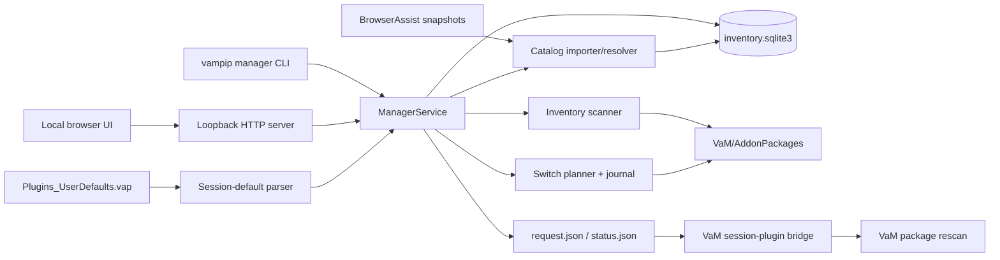

# VAM-PIP architecture

VAM-PIP is a Linux-first package manager for large Virt-A-Mate libraries. It
keeps every `.var` archive in place and controls what VaM can see by changing
only the filename suffix:

```text
Creator.Package.1.var
Creator.Package.1.var.vampip-disabled
```

The manager adds three concepts above the original inventory CLI:

- **pins** for packages that should always be available;
- **leases** for an exact, dependency-closed package set that expires;
- **managed mode**, which reconciles visible archives to the union of pins and
  active leases while preserving a rollback baseline.

This document describes the implementation in this repository. Safety
properties, operational rules, and the threat model are in
[SAFETY.md](SAFETY.md).

## Component map



The web server and CLI are adapters. Policy lives in
[`ManagerService`](../src/vampip/service.py), and package visibility mutations
live in [`switching.py`](../src/vampip/switching.py).

## Repository layout

| Path | Responsibility |
| --- | --- |
| [`src/vampip/database.py`](../src/vampip/database.py) | SQLite schema, migrations, WAL connections |
| [`src/vampip/inventory.py`](../src/vampip/inventory.py) | Incremental archive discovery and `meta.json` inspection |
| [`src/vampip/profiles.py`](../src/vampip/profiles.py) | Package reference resolution and the older one-shot profile workflow |
| [`src/vampip/manager_state.py`](../src/vampip/manager_state.py) | Pins, leases, baseline, settings, and desired-set calculation |
| [`src/vampip/switching.py`](../src/vampip/switching.py) | Managed switch plans, locking, manifests, apply, and rollback |
| [`src/vampip/catalog.py`](../src/vampip/catalog.py) | BrowserAssist import, search, resource resolution, and thumbnails |
| [`src/vampip/references.py`](../src/vampip/references.py) | Extra package references embedded in scenes and text presets |
| [`src/vampip/session_plugins.py`](../src/vampip/session_plugins.py) | Bounded parsing and classification of VaM's default Session Plugins preset |
| [`src/vampip/bridge.py`](../src/vampip/bridge.py) | Bridge installation and Linux-side mailbox client |
| [`src/vampip/runtime.py`](../src/vampip/runtime.py) | VaM process detection, root validation, and atomic text writes |
| [`src/vampip/service.py`](../src/vampip/service.py) | High-level manager policy and orchestration |
| [`src/vampip/web.py`](../src/vampip/web.py) | Token-authenticated loopback HTTP API and automatic reconciler |
| [`src/vampip/webui/`](../src/vampip/webui) | Dependency-free browser client |
| [`src/vampip/bridge_assets/`](../src/vampip/bridge_assets) | Bridge source embedded in the Python package |
| [`bridge/vam/`](../bridge/vam) | Standalone, GitHub-visible copy of the loose VaM bridge |

The packaged and standalone bridge `.cs` and `.cslist` files are intentionally
identical.

## Sources of truth

VAM-PIP separates observed state from desired state.

| Data | Source of truth |
| --- | --- |
| Archive existence and visibility | Files under `AddonPackages` |
| Package identity and dependencies | Filename plus root `meta.json` |
| Current inventory cache | `package_files` in SQLite |
| Permanent desired roots | `manager_pins` |
| Default session-plugin intent | `<VaM>/Custom/PluginPresets/Plugins_UserDefaults.vap` |
| Temporary exact closures | `manager_leases` and `manager_lease_packages` |
| Pre-manager visibility | `manager_baseline` |
| Resource catalogue | Last successfully imported BrowserAssist snapshot |
| One switch's recovery record | JSON file under `manager-runs/` |
| Live bridge request/result | VaM's `Saves/PluginData/VAMPip/Bridge/` |

The inventory and catalogue are rebuildable caches. Pins, leases, settings, and
especially the baseline are persistent manager state and should be backed up.

## SQLite state

[`database.py`](../src/vampip/database.py) currently defines schema version 3.
An installed CLI defaults its state directory to:

```text
${XDG_STATE_HOME:-~/.local/state}/vampip/
```

The checked-in `./vampip` and `./vampip-manager` launchers instead default to
the repository-local `.vampip/` directory. In either case, the database file
inside the selected state directory is `inventory.sqlite3`.

Connections enable:

- foreign keys;
- a five-second busy timeout;
- WAL journal mode;
- best-effort Unix permissions of `0700` on the state directory and `0600` on
  `inventory.sqlite3`;
- automatic schema creation and compatible migration;
- rejection of state created by a newer schema version.

The main table groups are:

- `package_files`: observed archive path, stat identity, parsed package
  identity, dependencies, optional SHA-256, and enabled state;
- `manager_settings`: managed mode, automatic reconciliation, API token, and
  optional launch script;
- `manager_pins`: permanent package roots;
- `manager_leases`, `manager_lease_roots`, and `manager_lease_packages`:
  temporary intent and the exact resolved snapshot;
- `manager_baseline`: the first recorded visibility for each logical archive
  path;
- `catalog_resources`, `catalog_resource_versions`, and `catalog_sources`:
  imported BrowserAssist data.

## Inventory and package identity

[`inventory.scan()`](../src/vampip/inventory.py) recursively discovers both
`.var` and `.var.vampip-disabled` files. A file is enabled exactly when its name
does not end in the disabled suffix.

The scanner is incremental:

1. An unchanged path with the same size, modification time, device, and inode
   reuses cached metadata.
2. A suffix rename is recognized by device and inode, so an enable/disable
   operation normally avoids reopening the ZIP.
3. New or changed archives are inspected for a root `meta.json`.
4. Files not observed in the current scan generation are removed from the
   inventory.

Package IDs follow `creator.package.version`; versions are numeric or
`latest`. Dependencies are flattened from VaM's nested `meta.json`
`dependencies` objects.

Archives that the scanner records as invalid or unidentifiable remain
inventoried, but managed switching does not hide them. Their identity cannot be
resolved reliably enough for an automatic visibility decision. Some ZIP-layer
errors, including encrypted members or unsupported compression, can currently
abort the scan instead of producing an invalid row.

### Copy preference and conflict checks

When several physical files claim one package ID,
[`preferred()`](../src/vampip/profiles.py) selects deterministically by:

1. shallower relative path;
2. canonical filename;
3. currently enabled copy;
4. shorter path;
5. case-folded lexical path.

Before a desired package is used, `ManagerService._verify_desired_copies()`
checks ambiguous copies. Different sizes are conflicts. Same-size copies are
hashed on demand; different known hashes are conflicts. A detected desired
same-ID conflict blocks pinning or reconciliation rather than making an
arbitrary content choice. Hashing currently skips an archive on `OSError`; if
every same-size copy remains unhashed, duplicate verification cannot prove
that their bytes differ and does not itself block the operation.

## Dependency resolution

[`profiles.resolve()`](../src/vampip/profiles.py) is shared by profiles and
managed mode.

- An exact root such as `Creator.Package.4` selects that installed ID.
- A family root such as `Creator.Package` selects the highest numeric version
  when one exists, otherwise the preferred installed nonnumeric (`latest`)
  copy.
- An exact installed ID is preferred, including the unusual case of a literal
  `Creator.Package.latest` package. Otherwise, a `.latest` reference resolves
  to the highest numeric version.
- Resolution recursively follows dependencies recorded from `meta.json`.
- Missing roots or dependencies are returned with their requiring package.

Each exact package ID appears once in a resolution. Different versions of one
family may both appear when exact dependency references require them.

## Pins, leases, and resource leases

### Pins

Pins store the user's root reference, not a frozen closure. They are resolved
again during reconciliation, so a family or `latest` pin can move to a newly
installed version. Creating a pin fails when its current dependency closure is
incomplete.

### Default session plugins

[`session_plugins.py`](../src/vampip/session_plugins.py) reads VaM's default
Session Plugins preset at:

```text
<VaM>/Custom/PluginPresets/Plugins_UserDefaults.vap
```

It identifies PluginManager slots, their enabled state, and whether each source
is a packaged virtual path or a loose script. Package roots are deduplicated
case-insensitively. Loose scripts are reported for visibility but need no pin:
managed mode changes only files under `AddonPackages`.

The preset is optional. A missing file produces an empty snapshot. An existing
file is read with a 16 MiB bound and must be valid UTF-8 JSON with an
unambiguous PluginManager structure, boolean enabled values, and valid package
references. Parsing errors are surfaced instead of partially trusting the
preset.

During the first applied managed-mode activation, enabled packaged roots join
the desired-set resolution. After a successful switch they are stored as
ordinary permanent pins, so later reconciliations preserve them. A malformed
preset or unresolved enabled root aborts activation before archive suffixes are
changed. Disabled entries are not automatic activation roots.

The same snapshot and import operation are available through:

```text
vampip manager session-plugins list
vampip manager session-plugins import [--include-disabled] [--apply]
GET  /api/session-plugins
POST /api/session-plugins/import
```

The import endpoint accepts `include_disabled` and `apply` booleans. Importing
creates missing pins immediately; `apply` also reconciles them when managed
mode is active under the same manager lock. Pin persistence is the primary
operation: if that reconciliation fails, the response keeps `applied` false,
includes `reconcile_error`, and leaves the imported pins for a later retry.
The browser UI's **Import session defaults** action and first-activation flow
use the enabled-only form. Importing disabled entries requires the explicit CLI
`--include-disabled` option or equivalent API request.

### Leases

A lease stores:

- the user-facing roots;
- creation and expiry times;
- the exact package IDs in the resolved dependency closure.

The exact snapshot prevents a temporary scene from silently changing versions
mid-lease. A package remains desired while at least one lease containing it has
an expiry later than the current UTC time. An expired lease no longer affects
the desired set. Its row is retained during previews and while VaM runs, then
removed after a successful applied reconciliation while VaM is closed. Manual
release can remove it sooner.

Renewal extends from the later of the current time and existing expiry.

### Leasing a catalog resource

`ManagerService.lease_resource()` first resolves the selected BrowserAssist
resource to either a safe loose file or an installed package version that
actually contains the resource member. For scene and other recognized text
formats,
[`references.py`](../src/vampip/references.py) also streams the selected file
and finds VaM virtual paths such as:

```text
Creator.Package.12:/Custom/file.vap
Other.Asset.latest:\Saves\scene\asset.json
```

Those undeclared references become additional lease roots. The normal package
resolver then follows each root's declared `meta.json` dependencies. Text
reference scanning is bounded at 256 MiB. A packaged binary resource leases
only its containing package and declared closure. A loose local resource with
no discovered package reference needs no lease; references found in a
supported loose text resource are leased normally.

## Managed-mode lifecycle

Managed mode is explicit. `reconcile(activate=True, apply=True)` captures the
baseline before taking control.

### Baseline

For every valid, identifiable archive, `manager_baseline` records:

- its logical relative path, without `.vampip-disabled`;
- its package ID;
- whether it was enabled;
- the first-recorded timestamp.

Rows use `INSERT OR IGNORE`, so an existing baseline value never drifts during
normal reconciliation. Newly discovered valid paths are added with the state
seen at their first subsequent applied reconciliation. A scan or preview alone
does not add a baseline row. Invalid archives are outside the baseline and are
left untouched.

Deactivation requires VaM to be closed. It builds a plan from the baseline,
restores the recorded state for matching current paths, clears the baseline,
and turns managed mode off. Pins and leases remain in SQLite.

Restore planning prefers exact path matches, so case-distinct Linux paths keep
independent baseline states. If an exact match is absent, one unique
case-insensitive baseline match may be used; an ambiguous fallback is skipped.

### Desired set

The managed desired set is:

```text
dependency closure of all pins
UNION
exact package snapshots of all unexpired leases
```

On first activation only, the enabled packaged roots detected in
`Plugins_UserDefaults.vap` are additional resolution roots and become
permanent pins after a successful applied switch. Unresolved pins or session
defaults, missing desired exact IDs, or detected same-ID content conflicts
block the switch.

### Reconciliation

`ManagerService.reconcile()` performs these steps under the Linux manager lock:

1. refresh the package inventory;
2. determine whether this is a new managed-mode activation;
3. on first activation, parse enabled packaged session defaults;
4. resolve pins, activation defaults, and active leases;
5. verify desired duplicate copies;
6. build the complete enable/disable plan;
7. detect whether VaM is running;
8. reduce the plan to enable-only when VaM is running;
9. return immediately for a preview, without baseline, pin, or mode changes;
10. for an apply, ensure and commit any new baseline rows, then run
    `apply_switch()`;
11. after a successful new activation switch, persist session-default pins and
    set `managed_mode`; if this persistence fails, attempt to roll the switch
    back from its manifest;
12. rescan the inventory after a real switch;
13. after a successful closed-state apply, remove expired lease rows.

If VaM was running and packages were enabled, the service publishes a bridge
rescan request atomically for live readers after leaving the
database/manager-lock scope.

| VaM state | Enable desired packages | Disable undesired packages | Bridge request |
| --- | --- | --- | --- |
| Closed | Yes | Yes | No |
| Running | Yes | Deferred | Yes, when at least one package was enabled |

`pending_disable` reports the complete plan's deferred removals. Releasing or
expiring a lease while VaM runs therefore never hides an archive from the live
process.

## Switch execution and recovery journal

[`apply_switch()`](../src/vampip/switching.py) derives every destination from
the current archive path. It validates that sources are files, targets do not
exist, and resolved source paths remain below the configured
`AddonPackages`.

The switch order is intentionally conservative:

1. enable desired archives;
2. disable undesired archives.

Leaving extra content visible is safer than removing a required dependency.
Every move is an adjacent `os.replace()`, which is atomic for the individual
filename change from the running process's perspective on the same filesystem.
The implementation does not `fsync` archive directories, so this is not a
power-loss durability guarantee.

Before the first rename, VAM-PIP writes a format-1 `manager-switch` manifest
under:

```text
<state-dir>/manager-runs/
```

The manifest moves through `planned`, `applying`, and `complete`, with each
entry updated after its rename. Manifest updates use a temporary file followed
by `os.replace()`, but do not `fsync` the file or its directory. After a caught
switch failure, VAM-PIP attempts reverse-order rollback and records
`rolled-back` or `rollback-failed` when journal writes remain available. A
journal I/O failure can prevent that best-effort rollback from starting or
finishing.

`rollback_switch()` validates manifest structure, action/path consistency,
AddonPackages containment, and the recorded device, inode, size, and
modification time before reversing entries marked `complete`.
Crash-level caveats and the recovery procedure are documented in
[SAFETY.md](SAFETY.md#crash-consistency-and-recovery).

SQLite state and archive renames do not share one transaction. Baseline rows
are committed before every switch. On initial activation, `managed_mode` and
session-default pins are committed afterward; a caught persistence failure
attempts to roll the completed switch back from its manifest. Deactivation
restores archives before clearing the baseline and flag. A crash or power loss
in one of these gaps can still leave the suffix state, baseline, and mode flag
out of agreement even when the switch manifest is understood.

Normal manager mutations are serialized with an advisory `fcntl` lock at:

```text
<state-dir>/manager.lock
```

The repository targets Linux. Manual rollback is a recovery operation and
should be run with both VaM and the manager server stopped.

## BrowserAssist catalog

[`import_browserassist()`](../src/vampip/catalog.py) imports BrowserAssist store
format 3 from:

```text
<VaM>/Saves/PluginData/JayJayWon/BrowserAssist/
```

It reads:

- `VARResourcesCoreData/*.manifest`;
- `VARResourcesUserData/*.userData`;
- `LocalResourcesUserData/*.userData`.

The importer treats BrowserAssist output as a snapshot:

1. enumerate all source files;
2. reject files whose pre-read size is larger than 64 MiB;
3. record device, inode, size, and modification time;
4. parse and validate every document before database mutation;
5. re-enumerate and compare all fingerprints;
6. upsert resources and remove stale rows inside a SQLite savepoint.

Any read, schema, snapshot, or database failure preserves the last good
generation. Stable logical keys keep resource IDs unchanged across successful
refreshes. The importer uses `read_bytes()` after the initial size check, so a
file that grows concurrently can temporarily allocate more than 64 MiB before
the changed fingerprint is rejected.

Packaged resources are joined to BrowserAssist favorites, hidden flags, and
tags by exact creator, package, and resource path. Local resources use a
separate path-only key.

### Resource and thumbnail resolution

The catalog does not assume the newest family version still contains a
resource. `_ResourceResolver` considers only versions associated by
BrowserAssist and verifies that the actual ZIP contains the requested member.
It prefers enabled and newer suitable copies.

Loose paths reject absolute paths, `..`, colon-bearing path components, and
any resolved path outside the VaM root. ZIP members use exact matching first
and a case-insensitive match only when it is unique.

Thumbnails are sibling `.jpg`/`.JPG` files. Reads are bounded to 16 MiB by
default and cached lazily under:

```text
<state-dir>/thumbnails/
```

Loose-file reads compare file identity before and after reading. The cache key
includes loose-file identity or the pre-read archive identity and ZIP member
metadata, so an observed source change produces a new cache entry.

## Web service and API

[`serve_manager()`](../src/vampip/web.py) starts a dependency-free
`ThreadingHTTPServer` and an `AutoReconciler`.

The server may bind only to `127.0.0.1` or `localhost`. Static UI files are
served from an explicit three-file allowlist. Every `/api/` request requires
the manager token.

Read endpoints expose status, packages, resources, facets, thumbnails, and the
detected default session plugins. Mutating endpoints cover scans, catalog
imports, session-default imports, pins, leases, reconciliation, deactivation,
settings, and VaM launch. The HTTP layer only validates and translates
requests; it delegates behavior to `ManagerService`.

The token is generated with `secrets.token_urlsafe(32)` and stored in
`manager_settings`. The launch URL carries it in a fragment. The UI moves it to
`sessionStorage`, removes the fragment from browser history, and normally sends
it in `X-VAMPIP-Token`.

The automatic reconciler wakes every 15 seconds by default:

- pending enables are applied even while VaM runs;
- pending disables are applied only after VaM is no longer detected;
- no action is taken outside managed mode or when auto-reconcile is disabled.

## VaM process detection and launch

[`find_vam_processes()`](../src/vampip/runtime.py) scans `/proc` and accepts a
process only when its `comm` or first command-line basename is `vam` or
`vam.exe`. Arbitrary command-line mentions do not count.

`ManagerService.launch_vam()` refuses to launch when VaM is already detected.
In managed mode it reconciles first by default, then executes either the
configured `launch_script` or:

```text
<VaM>/launch-vam-desktop-proton.sh
```

The script must be a regular executable file below the VaM root. It is invoked
as an argument vector, without `shell=True`, in a new session. Output is
appended to `<VaM>/logs/vampip-launch.log`.

## Bridge protocol

The Linux side is implemented in
[`bridge.py`](../src/vampip/bridge.py); the VaM side is the C# 6 session plugin
in [`bridge/vam/`](../bridge/vam).

The shared directory is:

```text
<VaM>/Saves/PluginData/VAMPip/Bridge/
```

### Request

The manager writes `request.json` through a temporary file and `os.replace()`,
making replacement atomic for live readers:

```json
{
  "protocol": 1,
  "requestId": "2f8fda6cb78145a087980e477b0c5c1e",
  "command": "rescan",
  "createdAtUtc": "2026-07-28T12:00:00+00:00",
  "browserAssist": "auto"
}
```

Protocol 1 accepts only `command: "rescan"` and `browserAssist: "auto"` or
`"off"`. Package names and filesystem paths are deliberately absent.

The session plugin:

- polls twice per second from Unity's main thread;
- treats the file as a latest-desired-state mailbox and coalesces replacements;
- ignores the last handled request ID;
- defers while `SuperController.singleton.isLoading`;
- rate-limits rescans to one every five seconds;
- tries BrowserAssist's public
  `JayJayWon.VARPackageManifest.RescanPackages()` via reflection;
- falls back to `SuperController.singleton.RescanPackages()`;
- never enables, disables, deletes, or launches anything.

If BrowserAssist throws after it has already entered its own rescan, the core
fallback can rarely perform the core scan a second time.

### Status

The plugin writes `status.json` with protocol/version, plugin instance ID,
request ID, last completed ID, state, timestamps, backend, and a diagnostic
message. Valid states are:

- `ready`;
- `deferred-loading`;
- `rescanning`;
- `ok`;
- `error`.

`backend` is empty while pending, `browserassist` after a successful
BrowserAssist path, or `vam` after the core path.

Status writes are not atomic. The Linux reader therefore treats a missing,
malformed-JSON, non-object, or wrong-protocol status as temporarily
unavailable. It does not otherwise schema-validate protocol-1 status fields. A
completed ID is carried forward and recovered on plugin restart. A request
that did not reach `ok` is eligible for one attempt in each new plugin session;
it is not retried repeatedly within one session.

The manager publishes a request but does not block until `ok`; callers that
need confirmation must poll status and match `requestId` themselves.

## One-shot profiles versus managed mode

The original `vampip profile` workflow remains available. It saves an exact
package list to JSON—normally a complete closure, or a partial result with
recorded missing references when creation explicitly uses `--allow-missing`—
and applies a one-time activation manifest while VaM is closed.

Managed mode is separate: it uses SQLite pins, expiring leases, a persistent
baseline, live enable-only reconciliation, and the bridge. Do not run a
one-shot profile activation concurrently with the manager server; both operate
on the same archive suffixes but use different intent and recovery records.
